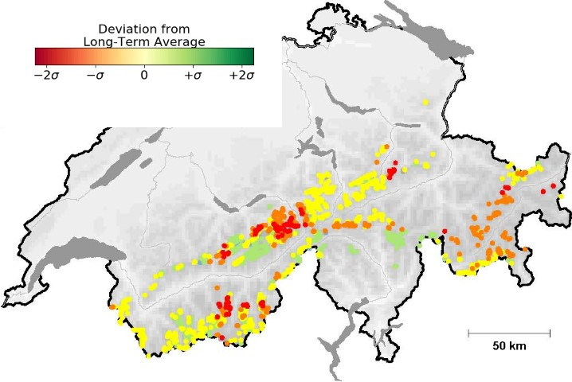

A Python project to monitor and predict glacier Mass Balance
============================================================

.. image:: https://travis-ci.com/jlandmann/crampon.svg?token=fJsScXTF7F6CQfcwxzzz&branch=master
        :target: https://travis-ci.com/jlandmann/crampon
        :alt: Linux build status

**Description**

This is what it should look like when it's done:

.. image:: /docs/_static/MB_line_example.png
         :height: 75px
         :width: 175 px
         :scale: 20%
|

Installation
------------

When everything is done, this will hopefully even be installable as a Python package.

Documentation
-------------

Might be hosted at `readthedocs.org`_, it would give a nice opportunity to inform about the project even though it is private content (Need to check if this makes sense/is in conflict). Maybe one could also create a synced lonely repot with just the docs.

.. _readthedocs.org: www.readthedocs.org

Contribution
------------

The number of participants in a private repo is of course limited, but, PLEASE, if you can contribute to the project regarding:

- The Physics/Glaciology/Empiry behind it

- General workflow/design improvements of the model

- Packages used

- Numerical/Computational effort behind it

- Useful APIs to other projects

Fork it and make a pull request or contact me personally or via the below contact deatils.

ToDo
----

There's tons of work. First steps might be:

- Set up a suitable lightweight test data set

- Write some simple mass balance code including a first, little test suite

- Run the test suite

- Extend the code to cover more and more processes

Contact
-------

| Johannes Landmann
| PhD student
| Swiss Federal Institute of Technology (ETH) Zurich
| Laboratory of Hydraulics, Hydrology and Glaciology (VAW)
| Hoenggerbergring 26 | HIA C 52.2
| 8093 Zurich | Switzerland
| Phone: +41 44 633 38 75
| Fax:   +41 44 632 11 92
| Mail:  landmann@vaw.baug.ethz.ch

Details
-------

:Status:

    Under development

:License:

    T.b.d.

:Hosting:

    At ETH and WSL

.. image:: https://www.ethz.ch/services/de/service/kommunikation/corporate-design/logo/_jcr_content/par/twocolumn_0/par_left/fullwidthimage/image.imageformat.lightbox.1322628801.png
    :height: 75px
    :width: 175 px
    :scale: 20 %
.. image:: https://upload.wikimedia.org/wikipedia/de/thumb/9/94/Logo_WSL.svg/200px-Logo_WSL.svg.png
    :height: 150px
    :width: 150 px
    :scale: 50 %
    :align: right
